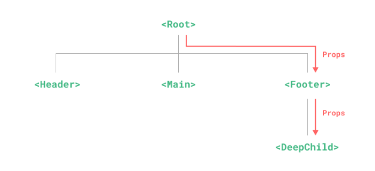
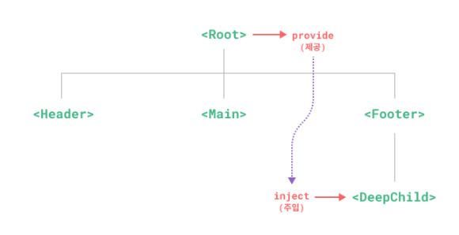

# Provide(제공) / Inject(주입)
## Prop 드릴링
일반적으로 부모 컴포넌트에서 자식 컴포넌트로 데이터를 전달해야 할 때 props를 사용합니다. 그러나 큰 컴포넌트 트리가 있고 깊이 중첩된 컴포넌트에 먼 조상 컴포넌트의 무언가가 필요한 경우를 상상해 보십시오. props만 있으면 전체 부모 체인에 동일한 prop을 전달해야합니다.



다시 말해 `Parent -> Child -> GrandChild`계층으로 이루어져있을 때, GrandChild가 Parent의 prop를 필요로 한다면 모든 props를 체인 형태로 전달받아야한다는 말이다.

사진을 살펴보면 `<Footer>`컴포넌트는 `<Root>`의 prop가 전혀 필요하지 않을 수 있다. `<DeepChild>`가 접근할 수 있도록 여전히 선언하고 전달해야하는 것이다. 
더 긴 상위 체인이 있으면 그 과정에서 더 많은 컴포넌트가 영향을 받는다.
이것은 "prop 드릴링"이라고 한다.

우리는 `provide`와 `inject`로 props 드릴링을 해결할 수 있다. 부모 컴포넌트는 모든 자식 컴포넌트에 대한 의존성제공자 역할을 할 수 있다. 하위 트리의 모든 컴포넌트는 깊이에 관계 없이 상위 체인의 컴포넌트에서 제공(provide)하는 의존성을 주입할 수 있다.



### Provide
컴포넌트 하위 항목에 데이터를 제공하려면 `provide()`함수를 사용하세요.
```typescript
<script setup>
import { provide } from 'vue'

provide( /* key */ 'message' , /* value */ '안녕!')
</script>
```

`<script setup>`을 사용하지 않는 경우 `setup()` 내부에서 `provide()`가 동기적으로 호출되는지 확인해야합니다.

```typescript
import { provide } from 'vue'

export default {
    setup() {
        provide( 'message', '안녕!')
    }
}
```

`provide()`함수는 두 개의 인자를 허용합니다. 첫 번째 인자는 주입 키라고 하며 문자열 또는 `Symbol`이 될 수 있습니다. 주입 키는 자식 컴포넌트에서 주입할 원하는 값을 조회하는데 사용됩니다.
단일 컴포넌트는 다른 값을 제공하기 위해 다른 주입 키를 사용하여 `provide()`를 여러번 호출할 수 있습니다.

두번째 인자는 제공되는 값입니다. 값은 refs와 같은 반응 상태를 포함하여 모든 유형이 될 수 있습니다.

```typescript
import { ref, provide } from 'vue'

const count = ref(0)
provide('key', count)
```

반응형 값을 제공하면, 제공된 값을 사용하는 자식 컴포넌트가 제공자 컴포넌트에 대한 반응형 연결을 설정할 수 있습니다.


## 앱 수준의 provide
컴포넌트에 데이터를 제공하는 것 외에도 앱 수준에서 다음을 제공할 수 있습니다.

```typescript
import { createApp } from 'vue'

const app = createApp({})

app.provide( 'message' , '안녕!')
```

앱 수준 제공은 앱에서 렌더링 되는 모든 컴포넌트에서 사용할 수 있습니다. 플러그인은 일반적으로 컴포넌트를 사용하여 값을 제공할 수 없기 때문에 플러그인을 작성할 때 특히 유용합니다

## Inject
부모 컴포넌트에서 제공하는 데이터를 주입하려면 `inject()`함수를 사용하세요

```typescript
<script setup>
import { inject } from 'vue'

const message = inject('message')
</script>
```

제공된 값이 ref인 경우, 그대로 주입되고 자동으로 래핑 해제되지 않습니다. 이를 통해 주입 대상 컴포넌트는 제공자 컴포넌트에 대한 반응성 연결을 유지할 수 있습니다.

주의해야할 것은 `<script setup>`을 사용하지 않는 경우, `inject()`는 `setup()`내에서 동기적으로 호출되어야합니다.

```typescript
import { inject } from 'vue'

export default {
    setup() {
        const message = inject('message')
        return { message }
    }
}
```

### 주입 시 기본 값 설정하기
기본적으로 `inject`는 주입된 키가 상위 체인의 어딘가에서 제공된다고 가정합니다. 키가 제공되지 않은 경우 런타임 경고가 표시됩니다.

제공자가 필수적으로 값을 제공하지 않는 환경에서 주입된 속성이 작동하려면 props처럼 기본 값을 선언해야합니다.

```typescript
// `value` 값은 "default Value"가 됩니다.
// "message"에 해당하는 데이터가 제공되지 않는 경운
const value = inject('message', '이것은 기본 값 문자열입니다.')
```
경우에 따라 함수를 호출하거나 새 클래스를 인스턴스화하여 기본값을 만들어야 할 수도 있습니다. 값이 제공되지 않는 경우, 불필요한 계산이나 사이드 이펙트를 피하기 위해 기본값을 생성하는 팩토리함수를 사용할 수 도있습니다.

```typescript
const value = inject('key', () => ExpensiveClass(), true)
```
세 번째 매개변수는 기본값이 팩토리 함수로 처리되어야함을 나타냅니다.

## 반응형으로 만들기
반응형 제공/주입 값을 사용할 때, 가능하면 제공자 내부에서 모든 변경사항을 반응성 상태로 유지하는 것이 좋습니다. 이렇게 하면 제공된 상태와 가능한 변화와 동일한 컴포넌트에 함께 배치되어 향후 유지관리가 더 쉬어집니다.

주입 대상 컴포넌트에서 데이터를 업데이트해야 하는 경우가 있습니다. 이러한 경우 상태 변경을 담당하는 함수를 제공하는 것이 좋습니다.

```typescript
<!-- 제공자 컴포넌트 내부 -->
<script setup>
import { provide, ref } from 'vue'

const location = ref('북극')    // 주입될 반응형 데이터

function updateLocation() {     // 반응형 데이터를 수정할 값값
  location.value = '남극'
}

provide('location', {
  location,
  updateLocation
})
</script>
```

```typescript
<!-- 주입되는 컴포는트 내부 -->
<script setup>
import { inject } from 'vue'

const { location, updateLocation } = inject('location') // 제공자에서 제공한 반응형 값과 setter 객체 주입
</script>

<template>
  <button @click="updateLocation">{{ location }}</button>
</template>
```

마지막으로, `provide`를 통해 전달된 데이터가 주입된 컴포넌트에 의해 변경될 수 없도록 하려면, 제공된 값을 `readonly()`로 래핑할 수 도 있습니다.


```typescript
<script setup>
import { ref, provide, readonly } from 'vue'

const count = ref(0)
provide('read-only-count', readonly(count))
</script>
```

## 심볼 키 사용하기
지금까지 예제에서 문자열 삽입 키를 사용했습니다. 많은 의존성 제공자가 있는 대규모 앱에서 작업하거나, 다른 개발자가 사용할 컴포넌트를 작성하는 경우, 잠재적 충돌을 피하기 위해 제공된 키로 `Symbol`(심볼)을 사용하는 것이 가장 좋습니다.

심볼을 전용 파일로 내보내는 것이 좋습니다.

```typescript
export const myInjectionKey = Symbol();
```
```typescript
// 제공하는 곳의 컴포넌트에서
import { provide } from 'vue'
import { myInjectionKey } from './keys.js'

provide(myInjectionKey, {
    /* 제공할 데이터 */
})
```

```typescript
// 주입된ㄴ 곳의 컴포넌트에서
import { inject } from 'vue'
import { myInjectionKey } from './keys.js'

const injected = inject(myInjectionKey)
```

## `provide`/`inject`의 타이핑
`provide`와 `inject`는 보통 서로 다른 컴포넌트에서 수행됩니다. 주입된 (inject)값의 타입을 적절히 지정하기 위해 Vue는 `InjectionKey`인터페이스를 제공하는데, 이는 `Symbol`을 확장하는 제네릭 타입입니다.

이를 사용하여 제공자와 소비자 간에 주입된 값이 타입을 동기화할 수 있습니다.

```typescript
import { provide, inject } from 'vue'
import type { InjectionKey } from 'vue'

const key = Symbol() as InjectionKey<string>

provide( key, 'foo')    // 문자열이 아닌 값을 제공하면 오류를 발생한다.

const foo = inject(key)
```
주입  키를 별도의 파일에 위치시켜 여러 컴포넌트에서 import할 수 있도록 하는 것이 좋습니다.

문자열 주입 키를 사용할 때, 주입된 값의 타입은 `unknown`이 될 것이며, 제네릭 타입 인자를통해 명시적으로 선언해야합니다.

```typescript
const foo = inject<string>('foo')   // 타입: string | undefined
```

주입된 값은 런타임에 제공자가 이 값을 제공한다는 보장이 없기 때문에 여전이 `undefined`일 수 있습니다.

`undefined` 타입은 기본 값은 제공함으로써 제거할 수 있습니다.
```typescript
const foo = inject<string>('foo','bar') // 타입 : string
```

값이 항상 제공된다고 확신한다면, 값을 강제로 캐스팅할 수도 있습니다.

```typescript
const foo = inject('foo') as string
```