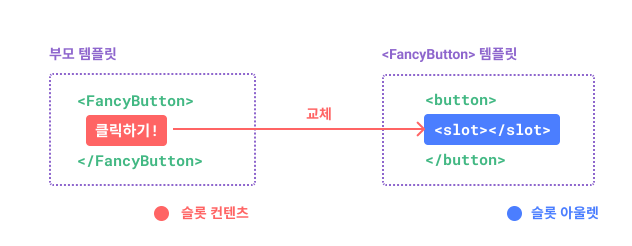
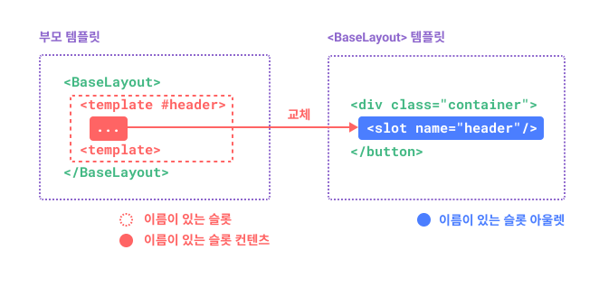
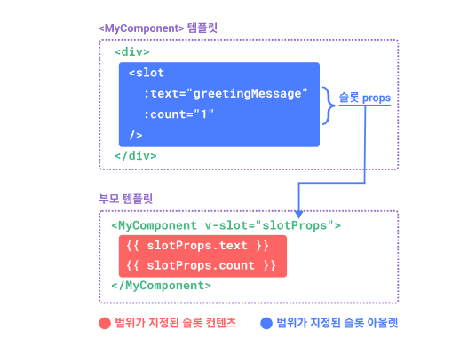

# 슬롯
## 슬롯 컨테츠와 아울렛
우리는 컴포넌트의 props가 모든 유형의 JS 값을 받을 수 있다는 것을 배웠습니다. 글나 템플릿 컨텐츠는 어떻습니까 ?
어떤 경우에는 템플릿 조각을 자식 컴포넌트에 전달하고 자식 컴포넌트가 자체 템플릿 내에서 조각을 렌더링하도록 할 수 있습니다.

예를 들어 다음과 같은 사용법을 지원하는 `<FancyButton>` 컴포넌트가 있을 수 있습니다
```typescript
<FancyButton>
</FancyButton>
```

`<FancyButton>`의 템플릿은 다음과 같습니다.
```typescript
<button class='fancy-btn'>
    <slot></slot>
</button>
```

`<slot>`엘리먼트는 부모가 제공한 슬롯 컨텐츠가 렌더링 되어야하는 위치를 나타내는 슬롯 아울렛입니다.



최종적으로 렌더링된 DOM은 아래와 같습니다.
```typescript
<button class='fancy-btn'>클릭하기!</button>
```

슬롯을 사용 시, `<FancyButton>`이 `<button>`(및 멋진 스타일 지정)을 렌더링하고, 내부 컨텐츠를 자식 컴포넌트에게 제공합니다.

슬롯을 이해하는 또 다른 방법은 슬롯 JavaScript  함수와 비교하는 것입니다.

```javascript
FancyButton('클릭하기')

function FancyButton(slotContent) {
    return `<button class='fancy-btn'>
        ${slotContent}
    </button>`
}
```

슬롯 컨텐츠는 텍스트에만 국한되지 않습니다. 모든 유효한 템플릿 컨텐츠 일 수 있습니다.
예를 들어 여러 엘리먼트 또는 다른 컴포넌트를 전달할 수 있습니다.

```html
<FancyButton>
    <span style='color:red'>클릭하기!</span>
    <AwesomeIcon name='plus' />
</FancyButton>
```
슬롯은 사용하면 `<FancyButton>`이 더 유연하고 재사용 가능하게 할 수 있습니다. 이제 내부 내용은 다르지만 모두 동일한 멋진 스타일로 다른 장송서 사용할 수 있습니다.

Vue 컴포넌트의 슬롯 메커니즘은 네이티브 웹 컴포넌트 `<slot>`엘리먼트에서 영감을 얻었고, 나중에 추가 기능에 대해 설명하겠습니다.

## 렌더링 범위
슬롯 컨텐츠는 부모 컴포넌트에 정의되어 있으므로 부모 컴포넌트의 데이터 범위에 접근할 수 있습니다.

예를 들어:
```html
<span>{{ message }}</span>
<FancyButton>{{ message }}</FancyButton>
```
여기서 `{{ message }}`이중 중괄호 문법은 동일한 컨텐츠를 렌더링합니다.

슬롯 콘텐츠에는 하위 컴포넌트의 데이터에 대한 액세스 권한이 없습니다. Vue 템플릿의 표현식은 JavaScript의 어휘 범위와 일치하도록 정의된 범위에만 액세스할 수 있습니다.
다시말해

```
상위 템플릿의 표현식은 상위 범위에만 액세스할 수 있고 하위 템플릿의 표현식은 하위 범위에서만 액세스할 수 있습니다.
```

## 대체 컨텐츠
슬롯에 대체(fallback) 컨텐츠를 지정하여, 컨텐츠가 제공되지 않을 때만 렌더링되도록 하는 것이 유용한 경우가 있습니다.

예를 들어 `<SubmitButton>` 컴포넌트에서 :
```html
<button type='submit'>
    <slot></slot>
</button>
```
부모가 슬롯 콘텐츠를 제공하지 않은 경우, "제출" 텍스트가 `<button>`내부에 렌더링되기를 원할 수 있습니다.
"제출"을 대체 컨텐츠로 지정하려면 `<slot>` 태그사이에 배치하면 됩니다.

```html
<button type='submit'>
    <slot>
        제출 <!-- 대체 컨텐츠 -->
    </slot>
</button>
```

이제 부모 컴포넌트 `<SubmitButton>`을 사용하여 슬롯에 컨텐츠를 제공하지 않습니다
```html
<SubmitButton />
```
그러면 대체 컨텐츠로 "제출"이 렌더링 됩니다.
```html
<button type='submit'>제출</button>
```

그러나 컨텐츠를 제공하는 경우 :
```html
<SubmitButton>저장</SubmitButton>
```
제공된 컨텐츠가 렌더링됩니다.

```html
<button type='submit'>저장</button>
```

## 이름이 있는 슬롯
단일 컴포넌트에 여러 개의 슬롯 아울렛이 있는 것이 유용한 경우가 있습니다.
예를 들어, `<BaseLayout>`템플릿 컴포넌트에서
```html
<div class='container'>
    <header>
        <!-- 여기에 헤더 컨텐츠를 원합니다 -->
    </header>
    <main>
        <!-- 여기에 메인 컨텐츠를 원합니다 -->
    </main>
    <footer>
        <!-- 여기에 푸터 컨텐츠를 원합니다 -->
    </footer>
</div>
```

이러한 경우, 슬롯에 고유 ID를 할당하는데 사용할 수 있는 `name`이라는 특수 속성을 사용하여, 컨텐츠가 렌더링되어야하는 위치를 `<slot>`엘리먼트가 결정할 수 있도록 할 수 있습니다.

```html
<div class='container'>
    <header>
        <slot name='header'></slot>
    </header>
    <main>
        <slot></slot>
    </main>
    <footer>
        <slot name='footer'></slot>
    </footer>
</div>
```
`name`이 없는 `<slot>`아울렛은 암시적으로 "default"라는 이름을 갖습니다.

`<BaseLayout>`을 사용하는 부모 컴포넌트에서 각각 다른 슬롯 아울렛을 대상으로 하는 여러 슬롯 컨텐츠 조각을 전달하는 방법이 필요합니다. 이럴 때 이름이 있는 슬롯을 사용합니다.

이름이 있는 슬롯을 전달하려면, `<template>`엘리먼트와 함께 `v-slot`디렉티브를 사용하고, 슬롯 이름을 `v-slot`에 인자로 전달해야 합니다.

```html
<BaseLayout>
    <template v-slot:header>
        <!-- 헤더 슬롯의 컨텐츠 -->
    </template>
</BaseLayout>
```
`v-slot`에는 전용 단축 문법인 `#`가 있으므로 `<template v-slot:header>`는 `<template #header>`로 단축할 수 있습니다.
이것은 자식 컴포넌트의 'header'슬롯에서 이 템플릿 조각을 렌더링한다는 것입니다.



다음은 단축 문법을 사용하여 세 슬롯의 컨텐츠를 모두 `<BaseLayout>`에 전달하는 코드입니다.

```html
<BaseLayout>
    <template #header>
        <h1>다음은 페이지 제목일 수 있습니다.</h1>
    </template>
    <template #default>
        <p>주요 내용에 대한 단락입니다.</p>
        <p>그리고 또 하나.</p>
    </template>
    <template #footer>
        <p>다음은 연락처 정보 입니다.</p>
    </template>
</BaseLayout>
```

컴포넌트가 기본 슬롯과 이름이 있는 슬롯을 모두 허용하는 경우, 모든 최상위 비 `<template>`노드는 기본 슬롯의 컨텐츠로 암시적으로 처리됩니다.
따라서 위의 내용은 다음과 같이 쓸 수도 있습니다.

```html
<BaseLayout>
    <template #header>
        <h1>다음은 페이지 제목일 수 있습니다.</h1>
    </template>
    <!-- implict default slot -->
    <p>주요 내용에 대한 단락입니다.</p>
    <p>그리고 또 하나.</p>
    
    <template #footer>
        <p>다음은 연락처 정보입니다.</p>
    </template>
</BaseLayout>
```

이제 `<template>`엘리먼트 내부의 모든 것이 해당 슬롯으로 전달됩니다. 최종 렌더링된 HTML은 다음과 같습니다.

```html
<div class='container'>
    <header>
        <h1>다음은 페이지 제목일 수 있습니다.</h1>
    </header>
    <main>
        <p>주요 내용에 대한 단락입니다.</p>
        <p>그리고 또 하나.</p>
    </main>
    <footer>
        <p>다음은 연락처 정보입니다.</p>
    </footer>
</div>
```

한번 더 언급하자면, JavaScript함수 비유를 사용하여 명명된 슬롯을 더 잘 이해하도록 해봅시다.

```javascript
// 이름이 다른 여러 슬롯 조각 전달
BaseLayout({
    header: `...`,
    default: `...`,
    footer: `...`
})

// <BaseLayout>은 그것들을 각자 해당하는 위치에 렌더링 됩니다.
function BaseLayout(slots) {
    return `<div class='container'>
        <header>${slot.header}</header>
        <main>${slot.main}</main>
        <footer>${slot.footer}</footer>
    </div>`
}
```

## 조건부 슬롯
때때로 슬롯이 있는지 여부에 따라 무언가를 렌더링하고 싶을 수 있습니다.
`$slot`속성과 `v-if`를 결합하여 이를 실현할 수 있습니다.

아래 예제에서는 세 가지 조건부 슬롯인 `header`, `footer`, 그리고 `default`를 가진 Card컴포넌트를 정의합니다.

header/footer/default가 있을 때 추가 스타일을 제공하기 위해 이를 감싸기를 원합니다.

```html
<template>
    <div class='card'>
        <div v-if='$slot.header' class='card-header'>
            <slot name='header' />
        </div>
        <div v-if='$slot.default' class='card-content'>
            <slot name='default' />
        </div>
        <div v-if='$slot.footer' class='card-footer'>
            <slot name='footer' />
        </div>
    </div>
</template>
```

## 동적인 슬롯 이름
동적인 디렉티브의 인자는 `v-slot`에서도 작동하므로 동적 슬롯 이름을 정의할 수 있습니다.

```html
<base-layout>
    <template v-slot:[dynamicSlotName]>
        ...
    </template>
    <!-- 단축 문법 사용 -->
    <template #[dynamicSlotName]>
        ...
    </template>
</base-layout>
```
표현식에는 디렉티브의 동적인 인자 문법 제약 조건이 적용됩니다.

## 범위가 지정된 슬롯
렌더링 범위에서 논의한 바와 같이 슬롯 컨텐츠는 자식 컴포넌트의 상태에 접근할 수 없습니다 .

그러나 슬롯의 컨텐츠가 상위 범위와 하위 범위의 데이터를 모두 사용할 수 있는 경우, 유용할 수 있습니다.

이를 구현하려면 자식이 데이터를 렌더링할 때 슬롯에 데이터를 전달할 수 있는 방법이 필요합니다.

사실, 우리는 정확히 그렇게 할 수 있습니다. props를 컴포넌트에 전달하는 것처럼 속성을 슬롯 아울렛에 전달할 수 있습니다.

```javascript
<div>
    <slot :text="greetingMessage" :count="1"></slot>
</div>
```
슬롯 props를 받는 것은 단일 기본 슬롯을 사용할 때와 명명된 슬롯을 사용할 때 약간 다릅니다. 자식 컴포넌트 태그에 직접 `v-slot`을 사용하여 단일 기본 슬롯을 사용하여 props를 수신하는 방법을 먼저 보여줄 것 입니다.

```javascript
<MyComponent v-slot="slotProps">
    {{ slotProps.text }} {{ slotProps.count }}
</MyComponent>
```


자식이 슬롯에 전달한 props는 해당 `v-slot`디렉티브의 값으로 사용할 수 있으며 슬롯 내부의 표현식에서 접근할 수 있습니다.

범위가 지정된 슬롯은 자식 컴포넌트에 전달되는 함수로 생각할 수 있습니다.
그런 다음 자식 컴포넌트가 이를 호출하고 props를 인자로 전달합니다.

```javascript
MyComponent({
    // 기본 슬롯을 함수로 전달합니다.
    default : (slotProps) => {
        return `${slotProps.text} ${slotProps.count}`
    }
})

function MyComponent(slots) {
    const greetingMessage = '안녕'

    return `<div>${
        // call the slot function with props!
        slots.default({ text: greetingMessage, count: 1})
    }</div>`
}
```

사실 이것은 범위가 지정된 슬롯이 컴파일되는 방법과 수동 렌더 함수에서 범위가 지정된 슬롯을 사용하는 방법에 매우 유사합니다.

`v-slot='slotProps'`가 슬롯 함수 특징과 어떻게 일치하는지 주목하십시오.
함수의 인자와 마찬가지로 `v-slot`에서 분해 할당을 사용할 수 있습니다.

```javascript
<MyComponent v-slot="{texts, count}">
    {{ text }} {{ count }}
</MyComponent>
```

### 이름이 있고 범위가 지정된 슬롯

이름이 있고 범위가 지정된 슬롯은 유사하게 작동합니다. 슬롯 props는 `v-slot`디렉티브으 값이 `v-slot:name='slotProps'`로 접근할 수 있습니다.
단축 문법을 사용하면 아래와 같습니다.

```javascript
<MyComponent>
    <template #header='headerProps'>
        {{ headerProps }}
    </template>
    <template #default='defaultProps'>
    </template>
    <template #footer='footer'
</MyComponent>
```

이름이 있는 슬롯에 props전달
```javascript
<slot name='header' mssage='안녕'></slot>
```

슬롯의 `name`은 예약되어 있기 때문에 props에 포함되지 않습니다. 따라서 `headerProps`의 결과는 `{ meesage: '안녕' }`이 됩니다.

명명된 슬롯과 기본 범위 슬롯을 혼합하는 경우, 기본 슬롯에 명시적인 `<template>`태그를 사용해야합니다. 컴포넌트에 `v-slot`지시어를 직접 배치하려고 하면 컴파일 오류가 발생합니다. 이는 기본 슬롯의 prop 범위에 대한 모호함을 피하기 위한 것입니다.

예를 들어
```typescript
// <MyComponent> template
<div>
    <slot :message='hello'></slot>
    <slot name='footer' />
</div>
```

```typescript
// This template won't compile
<MyComponent v-slot='{ message }'>
    <p>{{ message }}</p>
    <template #footer>
        // message belogs to the default slot, and is not availalbe here
        <p>{{ message }}</p>
    </template>
</MyComponent>
```

기본 슬롯에 명시적인 `<template>`태그를 사용하면 다른 슬롯에서 `message`props을 사용할 수 없음을 명확히 알 수 있습니다.